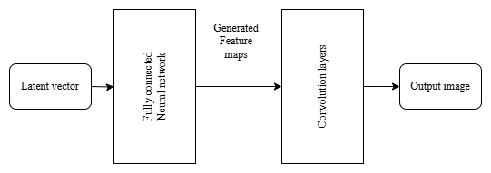
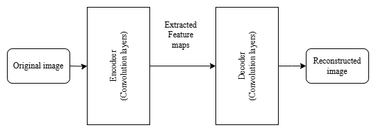
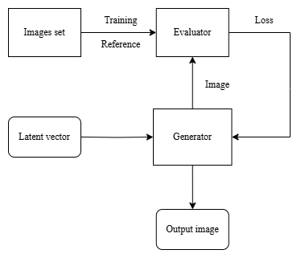
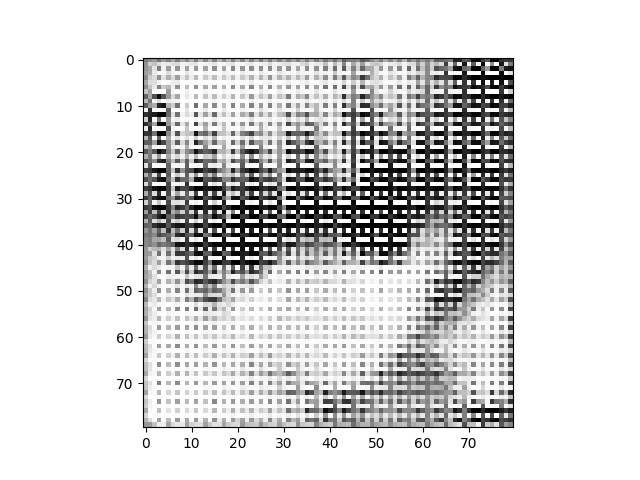
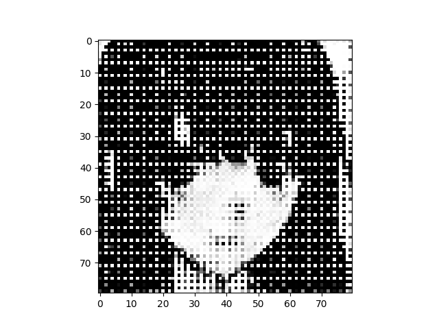
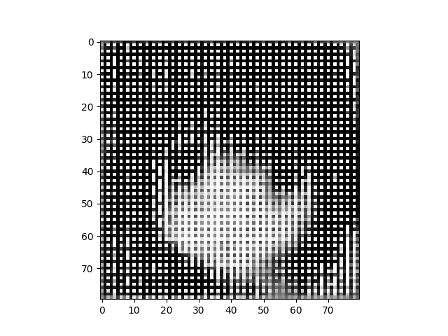

# Image-Generation
Specified type of image generation.

**Note:** The approach for this project could be significantly better. The functionality of this system is very poor.

Datasets (both are shortened in this repository):
- https://www.kaggle.com/datasets/olafkrastovski/handwritten-digits-0-9
- https://www.kaggle.com/datasets/splcher/animefacedataset

## Goal
The goal of this project was creating a specified type image generator. By specified I mean that the network will be trained for only one type of image (all the images will contain the same thing). Lets say for example a dog. Then the trained structure will generate pictures of dogs. 

## Structure
The idea for this generating system is kinda simple. Two models cooperating together. The first one we call **evaluator**. The purpose of evaluator model is to decide if an image is good or not. This model is trained with the training set, which consists of only images of a similar content. The trained model should be able to tell if provided image is similar to the training ones (has similar content) or not (random shapes or noise in most of the cases).

The second model we call **generator**. Generator is generating images which are being fed to the evaluator. The evaluator will then guide the generator to generate desired images.

### Generator
Lets start with the generator. The principle is very straight forward. The model is separated into 2 parts, first being **fully connected neural network** (FC NN). This part takes some latent vector (random vector) as input. By going through the layers the vector is transformed into a matrixes. These matrixes represents generated feature maps. The layers also help the model to be "creative" because they are changing the features.

The second part is using **convolution layers**, which takes the feature maps and creates an image from them.

*Generator structure*

### Evaluator
As the evaluator a **Convolutional AutoEncoder (CAE)** is used. CAE also consists of 2 parts, which are **encoder** and **decoder**. The principle is that an input image is encoded = extracting features with convolution layers. Then these feature maps are decoded back to the image. Decoding is a kinda reverse process that encoding that uses again convolution layers. This means that the model is learning to find features and reconstruct an meaningful image from the input. So lets say we will input some image. The CAE will try to recreate an image that it is familiar with (the type it was trained for).

The main benefit of CAE is that it can be trained with unlabeled images = so the dataset can contain only legit images. This fact simplifies the learning process kinda lot because it will be fine even with basic dataset. The downside of it (at least for me) is a harder output usage than would a CNN have.

*Evaluator structure*

### Compromise
When testing the system I had problems with tuning it. I couldn't achieve generator producing anything else than a noise or some shapes. As a solution I decided to make a compromise on function. The compromise lies within the evaluator guidance. The decision that I made is that when training the generator a random **reference image** will be taken from the original images set. This results in stronger evaluators guidance towards a desired output. A big downside of it is that the generated image will be eventually the same as the reference. To prevent that from happening there is a logic that will change the reference image over time. This should theoretically do that the generated image will take some features of each reference image. So instead of converging to the reference it kinda combines the references into a unique result.

The original approach was based on thresholding. The threshold that was applied to the evaluator's output decided if the image is good or not. So instead of using reference image an input image was used. But with this setting I was not able to train the generator to produce something at least remotely close to the desired output.

*System structure*

## Conclusion
This generating system is at the moment kinda functional but I would say it is very far from optional. For better performance there would be need for either a more intense tuning or to rebuild the whole project with maybe a CNN as an evaluator.

Instead of doing that I am rather looking forward towards a new project. Because at this moment I have already tried multiple models' topologies even with multiple training techniques. Even tho this project is maybe not so well executed I have learned a bunch of new things which in the end is the best outcome for me :smile:.

Showcases is based on anime profile pictures set.

*Reference changes every 10 epochs => total 5 references (50 epochs total)*

*Reference changes every 50 epochs => total 1 reference (50 epochs total)*

*Reference changes every 5 epochs => total 10 references (50 epochs total)*

## Notes
- Usage of reference image isn't the best
- Tuning two models to cooperate together could be pretty tricky
- The generator is highly biased by the reference image
    - Frequency of the changes (number of epochs it is trained with one reference)
    - Combination of frequency of the changes with total number of epochs (how many references it uses in the training)
    - The reference that is chosen (luck)
- CNN could perform better as an evaluator
- Trained generator produces always the same image
    - For different image a new training session have to be done